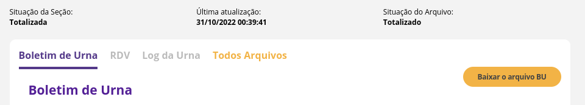

# Installation

```
$ pip install asn1tools asn1crypto ed25519 ecdsa
$ git clone https://github.com/cslashm/ECPy.git && cd ECPy && pip install .
```

- [TSE docs](https://www.tre-mt.jus.br/eleicoes/eleicoes-2022/documentacao-tecnica-do-software-da-urna-eletronica)

## Downloading files

Two files are needed:

1. The signature file (.vscmr)
2. The bu file (.bu)

Both can be downloaded on [TSE's website](https://resultados.tse.jus.br/oficial/app/index.html#/eleicao;e=e545;uf=rj;ufbu=rj;mubu=58653;zn=0071;se=0121/dados-de-urna/boletim-de-urna). You need to click on **Todos os Arquivos** and extract the files of interest.



## Usage

Use the `VSCMR_FILE_PATH` env variable to output the machine model.

```
# outputs model
VSCMR_FILE_PATH=/home/rafael/Downloads/o00406-5865300710121.vscmr python model.py
# ue2010
```

Use the `BU_FILE_PATH` env variable to output total votes.

```
# outputs votes
BU_FILE_PATH=/home/rafael/Downloads/o00407-5865300710121.bu python votes.py

# Total de Votantes: 338
# Partido 13: 196 (57.99%)
# Partido 22: 136 (40.24%)
# Brancos: 3 (0.89%)
# Nulo: 3 (0.89%)
# Votos Válidos: L 59.04% x B: 40.96%
```

## Other links

This code is also on [Google Colab](https://colab.research.google.com/drive/1e61P6WZ7cRbSG8CWudVw8qLJSdOOXa7K?usp=sharing).

Please note that you need to update the files in `/lib` and all data files there as well.
